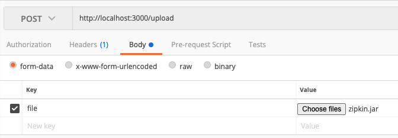

# GCP File Upload API

## Prerequisite Dependencies
* run `npm install` to install dependencies
* Create bucket in GCP Storage with bucket name: `fileStorage`
* Create GCP account access key
* rename file to `gcpKey.json`
* copy `gcpKey.json` file into `service/uploadService/util/auth/`

## Startup Server in Development Node
### NodeMon pre-requisite
install nodemone globally on your machine 
run `npm install nodemon -g`

## Run Service
### Dev Environment
run `npm run start:dev` in your terminal

### Production Environment
run `npm run start` in your terminal

## Upload File
### Using a client (e.g. PostMan) to test the file upload
* Open PostMan app
* Make a post request to `http://localhost:{port}/upload`
    * Headers
        * disable header item `Content-Type` (if it exists)
    * Body
        * form-data
        * Body: key: file 
        * click "choose files" button to attach test file to upload

